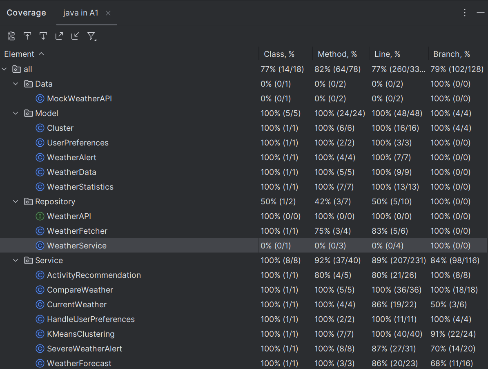

## Overview

- It provides user with current weather conditions and short-term forecasts and alerts for a given location.
- The application fetches weather data based on user input and displays it in an easy-to-read format.
- The application also allows users to compare weather between two locations.
- The application also has a feature where based on user's location it gives recommendation of activities for the next 3 days for the location provided.
- User can analyze the weather trend, where the application provides statistics of weather based on the past 1 week.
- As the project requires mocking the application will simulate interactions with a weather API using mock data sources.

## Features
- **Current Weather**: Display current weather conditions including temperature, humidity, and weather conditions (e.g., sunny, windy, cloudy, rainy).
- **Weather Forecast**: Display short-term weather forecasts for the next few days, including day-by-day temperature and weather conditions.
- **User Preferences**: Allow users to set preferences for temperature units (Celsius or Fahrenheit) and wind speed units (km/h or mph).
- **Severe Weather Alerts**: Alert users about severe weather conditions such as storms, heavy rain, or extreme temperatures, and provide safety tips.
- **Weather Trend Analysis**: Analyze weather trends over a period and generate weather alerts based on these trends.
- **Weather Comparison**: Compare weather conditions between two locations.
- **Forecast Next Day Temperature**: Forecast the temperature for the next day based on historical trends.
- **Activity Recommendation**: Recommends activities to user for next 3 days.

## How to start the application
- Follow the following steps to compile and run the java code from terminal
- Step 1 : cd src/main/java
- Step 2 : javac Main.java
- Step3 : java Main

## Project Structure

- 'java'
  - 'Main.java'
  - 'Data'
    - 'MockWeatherAPI.java'
  - 'Model'
    - 'Cluster.java'
    - 'UserPreference.java'
    - 'WeatherAlert.java'
    - 'WeatherData.java'
    - 'WeatherStatistics.java'
  - 'Repository'
    - 'WeatherAPI.java'
    - 'WeatherFetcher.java'
    - 'WeatherService.java'
  - 'Service'
    - 'ActivityRecommendation.java'
    - 'CompareWeather.java'
    - 'CurrentWeather.java'
    - 'HandleUserPreference.java'
    - 'KMeansClustering.java'
    - 'SevereWeatherAlert.java'
    - 'WeatherForecast.java'
    - 'WeatherTrendAnalyzer.java'
  - 'UserInterface'
    - 'Application.java'

## Test Coverage
- 
- The Service package is the main package which has all the major business logic and it has a 92% of test coverage as there were some methods which were irrelevant for testing.
